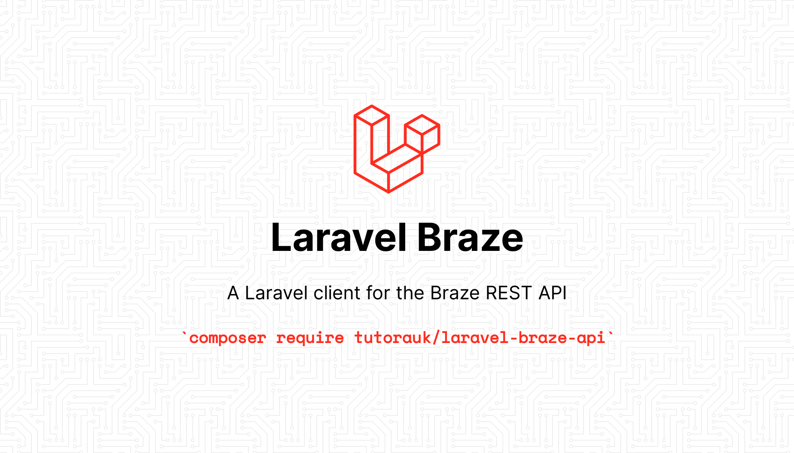

[](https://packagist.org/packages/tutorauk/laravel-braze-api)
[](https://github.com/tutorauk/laravel-braze-api/actions/workflows/run-tests.yml)
[](https://github.com/tutorauk/laravel-braze-api/actions/workflows/fix-php-code-style-issues.yml)
[](https://github.com/tutorauk/laravel-braze-api/actions/workflows/php-cs-fixer.yml)
[](https://packagist.org/packages/tutorauk/laravel-braze-api)
[](LICENSE.md)

Laravel wrapper around the [immobiliare/braze-php-sdk](https://github.com/immobiliare/braze-php-sdk) package.

## Installation

You can install the package via composer:

```bash
composer require tutorauk/laravel-braze-api
```

Then you need to your Braze api key and the correct rest endpoint to your `.env` file:

```bash
BRAZE_API_KEY='apiKey'
BRAZE_REST_ENDPOINT=https://rest.fra-02.braze.eu
```

### Http Client Adapters

This package has support for the [Laravel HTTP Client](https://laravel.com/docs/http-client) or [Guzzle](https://docs.guzzlephp.org/en/stable/). 
The Laravel HTTP Client is the default and preferred client. Utilising the Laravel client, enables you to take advantage of Laravels [testing helpers](https://laravel.com/docs/http-client#testing) within your tests.

If you would prefer to use Guzzle, you can specify the adapter in your `.env` file:

```bash
BRAZE_CLIENT_ADAPTER=guzzle
```

## Usage

This package binds a singleton to the Laravel service container, so you can easily resolve the Braze client directly from the container, or via dependency injection. Alternatively, the package also exposes both a Facade and a helper function should you prefer a shorter more expressive option.

```php
// Resolve service directly from container and access the users endpoint
app(Braze::class)->users();

// Resolve via Facade and access the users endpoint
Braze::users(); 

// Resolve service via helper and access the users endpoint
braze()->users();
```

## Testing, Static Analysis and Formatting

```bash
composer test
composer analyse
composer format
```

## Thanks
Big shout out to [Immobiliare Labs](https://github.com/immobiliare) for their [Braze PHP SDK](https://github.com/immobiliare/braze-php-sdk) package. They did all the hard work 👏! 

## Changelog

Please see [CHANGELOG](CHANGELOG.md) for more information on what has changed recently.

## Contributing

Please see [CONTRIBUTING](CONTRIBUTING.md) for details.

## Security Vulnerabilities

Please review [our security policy](../../security/policy) on how to report security vulnerabilities.

## Credits

- [Rick West](https://github.com/rickwest)
- [All Contributors](../../contributors)

## License

The MIT License (MIT). Please see [License File](LICENSE.md) for more information.
